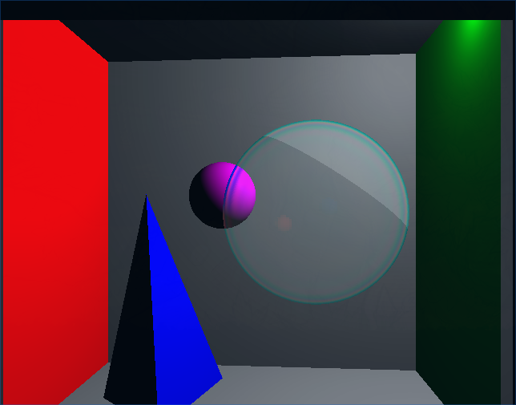

# :mortar_board: CPSC 591 Project 

- Rendering - Winter 2020 - Project

## About
Real-time rendering of soap-bubble with light interference effect



## Short Description
Method of rendering soap-bubble in real time, with light interference effect

Overall method is based on Fresnel Effect Equation and K. Iwasaki[1]'s proposal

Main points are
- Conversion from wavelength to XYZ/RGB [2]
- Generate and use bubble texture map rather than using costly raytracing method

Short result
- About 10 times faster than traditional raytracing fresnel effect
- Further optimization is possible

## Compiling and Running

code is set at opengl ver 3.3, so if OpenGL version error is found in compiling stage, fix following files:
- src/utilities/Constants.h
    - GLFW_MAJOR_VERSION (@ubuntu 18.04, value should be 3)
    - GLFW_MINOR_VERSION (@ubuntu 18.04, value should be 3)


1. initialize git submodules first
```bash
git submodule update --init --recursive
```

2. Next, execute `makefile` to compile
```bash
$ make -j$(nproc)
```

3. Run the program
```bash
$ ./program.out
```

## Controls
```
| Key       | Commands |
|:---------:|:--------:|
| Esc                           | Exit program   |
| 1                             | Display Light texture map (Toggle)  |
| 2                             | Display bubble's texture map (Toggle)  |
| 3                             | Use Traditional Method (Toggle)   |
| 4                             | Use Optimized Method, only when not using traditional method (Toggle)  |
| R                             | Reset Camera   |
| W/A/S/D                       | Move camera up/down/left/right   |
| UP/DOWN/LEFT/RIGHT            | Rotate camera up/down/left/right around centre point |
| SHIFT+(UP/DOWN/LEFT/RIGHT)    | Pan camera up/down/left/right   |
| Q/E                           | Rotate camera clockwise/counter-clockwise  |
| Page_UP/Page_Down             | Zoom/Unzoom camera towards centre point   |
| Space/SHIFT+Space             | Move camera forward/backward to centre point   |
| [/]                           | Decrease/Increase FOV  |
| -/+                           | Decrease/Increase bubble's thickness |

```

## Additional Information

Scenes are stored in json format
- Scenes are stroed in resources/scenes/
- Manual for the format is stored in resources/scenes/README.md

## References

[1] Real-time Rendering of Soap Bubbles Taking into Account Light Interference, K. Iwasaki, 2004, IEEE.
(https://ieeexplore.ieee.org/document/1309231)

[2] Colour Rendering of Spectra, John Walker, 1996
(http://www.fourmilab.ch/documents/specrend)

[3] Low-Pressure Sodium Issues and FAQ, Christian B. Luginbuhl, 2007, NOFS
(www.nofs.navy.mil/about_NOFS/staff/cbl/LPSnet/LPS-references.html)
(https://web.archive.org/web/20070921011912/http://www.nofs.navy.mil/about_NOFS/staff/cbl/LPSnet/LPS-references.html) 

[4] Light Emitting Diodes: A primer
(https://www.photonics.com/Articles/Light-Emitting_Diodes_A_Primer/a36706)


## Author

SeungBin Yim (seungbin.yim1@ucalgary.ca)
